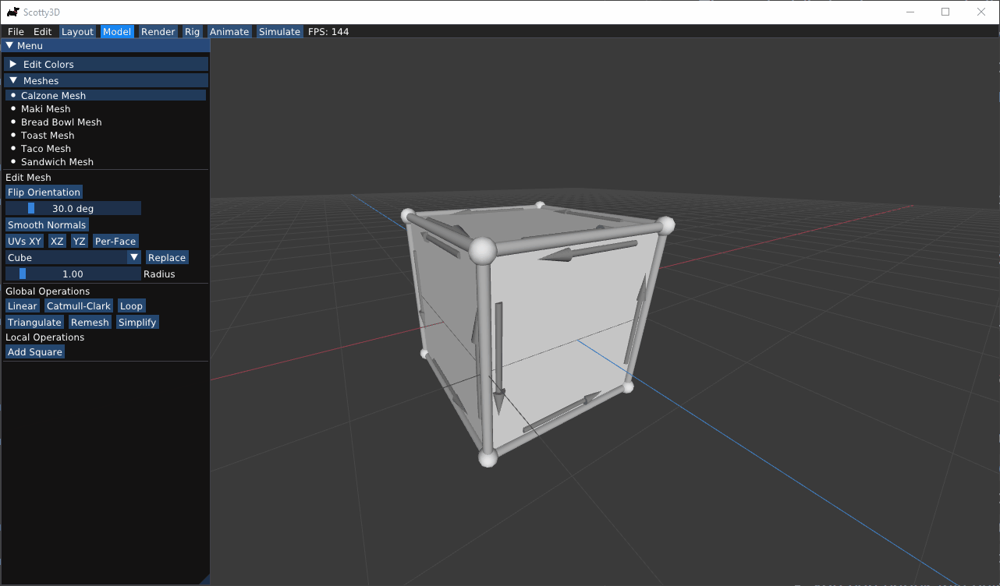

# Scotty3D

Scotty3D is the 3D modeling, rendering, and animation package that students complete as part of [15-462/662 Computer Graphics](http://15462.courses.cs.cmu.edu) at Carnegie Mellon University.

The current version of the starter code is available at https://github.com/CMU-Graphics/Scotty3D .

User documentation and example works are available at https://cmu-graphics.github.io/Scotty3D-docs/ .

Note that the source code is in a private repository since this project is an assignment for students, and I want to avoid posting the solutions publicly. 

If you are not a student from CMU and are interested in the implementation, please feel free to contact me.


## What I implemented

I implemented all required functionalities except for A4T4, which consist of Assignment 1: Rasterizer, Assignment2: Mesh Editing, Assignment3: Path Tracing, and Assignment4: Animation. Additionally, I implemented the microfacet model described in [Real Shading in Unreal Engine 4](https://cdn2.unrealengine.com/Resources/files/2013SiggraphPresentationsNotes-26915738.pdf), which takes 4 parameters: base color, specular color, roughness and metallic.

### Rasterizer
In this part, I implemented a software rasterizer that simulates the OpenGL pipelines. The rasterizer takes arrays of vertices as input,  and outputs the rendered images. The rasterizer supports triangle clipping, alpha blending, depth testing, and supersampling. It can also generate mip-maps from textures and perform tri-linear sampling with lod determined by derivatives. Note that instead of compiling GLSL files, we hardcode the vertex and fragment shaders in ./src/rasterizer/programs.h.


### Mesh Editing
In this part, I implemented some mesh editing operations based on the half-edge data structure, including edge flipping, edge splitting, edge collapsing, edge welding, and face extruding. I also implemented some global operations: triangulation, linear subdivision, Catmull-Clark subdivision, Loop subdivision, isotropic remeshing, and quadratic error metric mesh simplification.

Here are examples for each operation.

Flip Edge

 

Split Edge


Collapse Edge


[README.md](README.md)
Weld Edge


Extrude Face


Triangulation



Linear Subdivision


Catmull-Clark Subdivision


Loop Subdivision


Isotropic Temeshing


Quadratic Error Metric Mesh Simplification


### Path Tracing

In this part, I implemented the Monte Carlo path tracing. The path tracer will first construct a bounding volume hierarchy (BVH) to detect ray-mesh-intersections. I implemented 5 materials: Lambertian, Mirror, Refract, Glass, and UnrealFour. The last one is the microfacet model described in [Real Shading in Unreal Engine 4](https://cdn2.unrealengine.com/Resources/files/2013SiggraphPresentationsNotes-26915738.pdf). The path tracer also supports importance sampling for Lambertian, surface light, environment light, and GGX/Trowbridge-Reitz.

Here are some examples of ray tracing.

Lambertian


Mirror and Glass


UnrealFour (metallic = 0.0, roughness = 1.0)


UnrealFour (metallic = 0.3, roughness = 0.8)


UnrealFour (metallic = 0.5, roughness = 0.5)


UnrealFour (metallic = 0.8, roughness = 0.3)


UnrealFour (metallic = 1.0, roughness = 0.02)


UnrealFour (metallic = 0.0, roughness = 0.1)


UnrealFour (metallic = 0.75, roughness = 0.3)


Environment Lighting


### Animation

In this part, I implemented some basic functionalities for making animations, including spline interpolation, forward kinematics & inverse kinematics, and linear blend skinning.

Spine Interpolation


Forward Kinematics


Inverse Kinematics


Linear Blend Skinning


## GitHub Setup

Please do not use a public GitHub fork of this repository! We do not want solutions to be public. You should work in your own private repo.
We recommended creating a mirrored private repository with multiple remotes. The following steps go over how to achieve this.

The easiest (but not recommended) way is to download a zip from GitHub and make a private repository from that. The main disadvantage with this is that whenever there is an update to the base code, you will have to re-download the zip and manually merge the differences into your code. This is a pain, and you already have a lot to do in 15462/662, so instead, let `git` take care of this cumbersome "merging-updates" task:

1. Clone Scotty3D normally
    - `git clone https://github.com/CMU-Graphics/Scotty3D.git`

2. Create a new private repository (e.g. `MyScotty3D`)
    - Do not initialize this repository - keep it completely empty.
    - Let's say your repository is now hosted here: `https://github.com/your_id/MyScotty3D.git`

3. Ensure that you understand the concept of `remote`s in git.
    - When you clone a git repository, the default remote is named 'origin' and set to the URL you cloned from.
    - We will set the `origin` of our local clone to point to `MyScotty3D.git`, but also have a remote called `sourcerepo` for the public `Scotty3D` repository.

4. Now go back to your clone of Scotty3D. This is how we add the private remote:
    - Since we cloned from the `CMU-Graphics/Scotty3D.git` repository, the current value of `origin` should be `https://github.com/CMU-Graphics/Scotty3D.git`
        - You can check this using `git remote -v`, which should show:
            ```
            origin      https://github.com/CMU-Graphics/Scotty3D.git (fetch)
            origin      https://github.com/CMU-Graphics/Scotty3D.git (push)
            ```
    - Rename `origin` to `sourcerepo`:
        - `git remote rename origin sourcerepo`
    - Add a new remote called `origin`:
        - `git remote add origin https://github.com/your_id/MyScotty3D.git`
    - We can now push the starter code to our private copy:
        - `git push origin -u main`

5. Congratulations! you have successfully _mirrored_ a git repository with all past commits intact. 

Now, let's see why this setup may be useful: say we start doing an assignment and commit regularly to our private repo (our `origin`). Then the 15-462 staff push some new changes to the Scotty3D skeleton code that we want to pull in. But, we don't want to mess up the changes we've added to our private copy. Here's where git comes to the rescue:

1. Commit all local changes to your `origin`.
2. Run `git pull sourcerepo main` - this pulls all the changes from `sourcerepo` into your local copy.
    - If there are files with changes in both `origin` and `sourcerepo`, git will attempt to automatically merge the updates. Git may create a "merge" commit for this.
    - Unfortunately, there may be conflicts. Git will handle as many merges as it can, then then tell you which files have conflicts that need manual resolution. You can resolve the conflicts in your text editor and create a new commit to complete the `merge` process.
3. After you have completed the merge, you now have all the updates locally. Push to your private origin to publish changes there too:
    - `git push origin main`


## General Setup

1. Install a C++ compiler:
  - Windows: Visual Studio 2022
  - MacOS: XCode (latest available)
  - Linux: g++ (latest available)
2. Install [node](https://nodejs.org) (our build system is written in command-line javascript.)
3. Clone this repository.
4. Download and extract the nest-libs as a child of the repository folder:
  - Linux: https://github.com/15-466/nest-libs/releases/download/v0.10/nest-libs-linux-v0.10.tar.gz
  - MacOS: https://github.com/15-466/nest-libs/releases/download/v0.10/nest-libs-macos-v0.10.tar.gz
  - Windows: https://github.com/15-466/nest-libs/releases/download/v0.10/nest-libs-windows-v0.10.zip


## Building and Running

Run, from a command prompt that has your compiler available:
```
#change to the directory with the repository:
$ cd Scotty3D
#use Maek to build the code:
Scotty3D$ node Maekfile.js
#run the UI:
Scotty3D$ ./Scotty3D
#run the tests:
Scotty3D$ ./Scotty3D --run-tests
```
Note that you _should_ read `Maekfile.js`. about the available command line options and how to configure your own build. All the code has been nicely documented to help you understand the building process and reinforce your learning.

## Updating
Run `git pull` to make sure you have the latest handout version. We'll let you know when to do this, but generally you should pull before starting on a new assignment (e.g. when you switch from A1 to A2).

## Useful Resources
More info about Scotty3D can be found in the [User Guide](https://cmu-graphics.github.io/Scotty3D-docs/guide/) (and again, `Maekfile.js`!). We will also post on [Piazza](https://piazza.com/class/l7euxsj4kf4ht/) if there's an update you should be aware of. Make sure you have access to these, and don't hesitate to ask questions!
